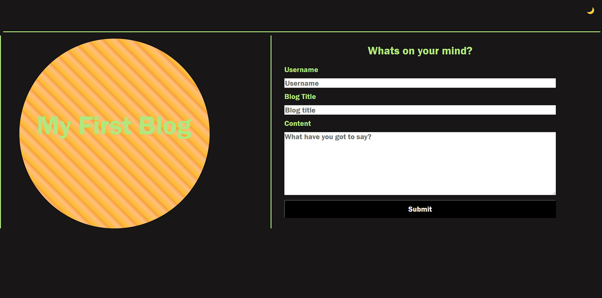
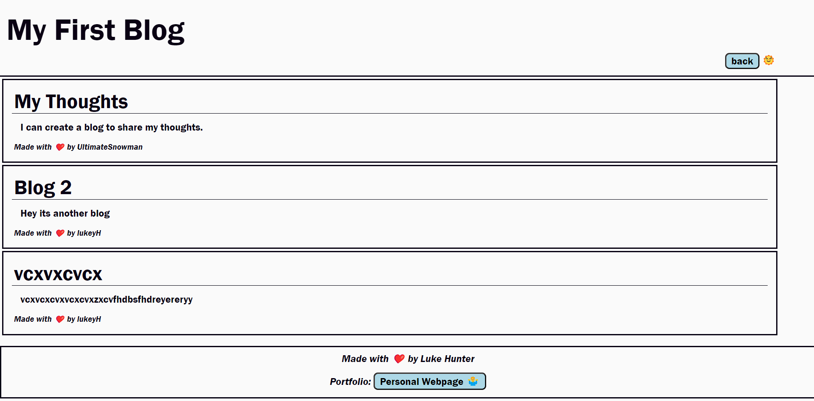

# My Blog
Form webpage: https://lukehunter1991.github.io/my_blog/index.html  

Blog webpage: https://lukehunter1991.github.io/my_blog/blog.html  

CSS: assets/css  

javaScript: assets/js  

## Description

I've created 2 webpage to allow for the creation and hosting of personal blog posts. The blog username, title, and content are created using a form on index.html. That blogm is then formatted and hosted on blog.html. This allows me to share me, and anyone else who wishes, to share our thoughts in the form of a blog. In building this project I learned a bout storing and retrieving data in local storage. 

## Installation

No installation needed. Simply head to the index.html page to post a blog.

## Usage

In order to post a blog you must first go to https://lukehunter1991.github.io/my_blog/index.html where you will see a form with 3 fields and a submit button. You must provide a username, title, and some blog text. If you try to submit the form without adding some text to all 3 fields the form will not submit. YOu will also be promted with an error message. Onmce the form has been succesful submitted you  will automatically be redirected to the blog page where you will see the blog that you jsut posted, along with any other blog stored in your local storage.  

In the top right hand corner of the page you wiill see a small sun icon. Click on this to toggle between light and dark mode.

## Credits

No credits needed. All content and code is proudly bought to you by me, Luke Hunter ❤️

